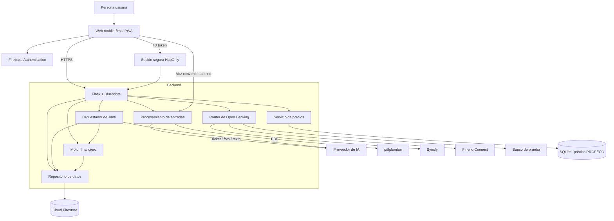

# Summa

> El copiloto financiero del hogar.

Summa es una aplicación web *mobile-first*, instalable como PWA y preparada para evolucionar a una aplicación móvil. Ayuda a las familias a registrar, comprender y anticipar sus gastos, incluyendo operaciones en efectivo que normalmente quedan fuera de las aplicaciones bancarias.

El proyecto se desarrolla para **HackaTec 2026**, dentro del reto **HackaHer** y la temática **Fintech y Economía Familiar**.

> **Estado del proyecto:** diseño funcional e implementación inicial para un prototipo de hackathon. Las integraciones bancarias, predicciones y comparaciones dependen de la disponibilidad de datos, credenciales y proveedores externos. La interfaz nunca debe presentar datos simulados como si fueran reales.

## Problema

Muchas familias conocen cuánto ingresan, pero no necesariamente cuánto pueden gastar hoy sin comprometer pagos futuros. El problema se agrava cuando existen ingresos variables, compras en efectivo, gastos estacionales, créditos y precios diferentes entre comercios.

Las herramientas tradicionales suelen mostrar lo que ya ocurrió. Summa busca anticipar lo que puede ocurrir y convertir los datos del hogar en acciones comprensibles.

## Propuesta de valor

Summa permite:

- Registrar ingresos y gastos manualmente, por voz, fotografía, ticket, PDF o conexión bancaria autorizada.
- Calcular cuánto puede gastar el hogar sin comprometer pagos próximos.
- Identificar pagos recurrentes, gastos atípicos y temporadas de mayor gasto.
- Sugerir presupuestos y metas de ahorro según la composición del hogar.
- Predecir reposiciones de productos a partir del historial de compras.
- Comparar precios de la canasta entre supermercados cercanos utilizando información verificable.
- Consultar la información mediante **Jami**, un asistente que explica resultados y guía la navegación.

La IA propone y explica; la persona confirma y decide.

## Funcionalidades principales

### Finanzas del hogar

- Creación de un hogar o incorporación mediante código de invitación.
- Registro de integrantes, ingresos, pagos fijos, créditos y metas.
- Panel con ingreso del periodo, dinero comprometido, disponible y monto sugerido para gastar hoy.
- Presupuesto mensual por categoría.
- Alertas al alcanzar el 80 % o 100 % de una categoría.
- Calendario de pagos y gastos estacionales.
- Reportes y recomendaciones personalizadas.

### Registro multimodal

- **Manual:** monto, categoría, fecha y método de pago.
- **Ticket:** extracción de comercio, total y productos.
- **Foto:** lectura de recibos, notas y comprobantes.
- **PDF:** detección y confirmación de movimientos.
- **Voz:** interpretación de uno o varios movimientos en español.
- **Banco:** importación mediante conectores de Open Banking cuando estén disponibles.

Los archivos se procesan en memoria y se descartan. Summa conserva únicamente la información que la persona confirma.

### Mandado inteligente

- Historial de productos comprados.
- Predicción de próximas compras.
- Carrito sugerido y editable.
- Comparación de tres supermercados cercanos.
- Precios con fuente y fecha visibles.

### Jami

Jami puede explicar el presupuesto, consultar movimientos, analizar alertas, responder preguntas sobre el hogar y llevar al usuario a la pantalla correspondiente. Los cálculos se realizan en el backend; el modelo de IA solamente interpreta solicitudes o redacta explicaciones con los datos autorizados.

Ejemplos:

- “¿Cuánto puedo gastar esta semana?”
- “¿Por qué se redujo mi disponible?”
- “¿Me alcanza para el regreso a clases?”
- “Llévame a mi mandado.”

## Principios del producto

1. **Funciona sin conectar un banco.** La conexión bancaria automatiza el registro, pero no es obligatoria.
2. **La IA no inventa datos.** Si no existe información suficiente, la plataforma lo indica.
3. **Toda clasificación automática se confirma.** El usuario puede aceptar o corregir la categoría.
4. **Privacidad desde el diseño.** Se minimizan los datos enviados a proveedores externos.
5. **Lenguaje sencillo.** Los resultados financieros se explican sin tecnicismos innecesarios.
6. **Una acción principal por pantalla.** El flujo está diseñado para dispositivos móviles.

## Arquitectura

Summa utiliza una arquitectura web por capas. El navegador se encarga de la interfaz y la autenticación inicial; Flask concentra las reglas de negocio y evita que la interfaz acceda directamente a información sensible.



### Responsabilidad de cada capa

| Capa | Responsabilidad |
|---|---|
| Web/PWA | Interfaz, navegación, formularios, cámara, voz y estados vacíos. |
| Firebase Authentication | Inicio de sesión con Google o correo y emisión del token de identidad. |
| Flask | Sesiones, autorización, validación, reglas de negocio y coordinación de servicios. |
| Motor financiero | Disponible del periodo, presupuestos, ahorro, alertas, rachas y predicciones. |
| Procesamiento multimodal | Extracción y normalización de tickets, fotos, voz y PDF. |
| Jami | Selección de herramientas y explicación de resultados; no calcula montos por sí mismo. |
| Repositorio Firestore | Único punto de acceso a los datos del hogar. |
| SQLite/PROFECO | Consulta local de precios públicos, sin consumir operaciones de Firestore. |
| Conectores bancarios | Normalización de cuentas y movimientos de distintos proveedores. |

### Flujo de autenticación

1. La persona inicia sesión con Firebase Authentication desde el navegador.
2. Firebase entrega un ID token temporal.
3. El navegador envía el token a `POST /auth/session`.
4. Flask verifica el token y crea la cookie `__session`.
5. La cookie es `HttpOnly`, `SameSite=Lax` y `Secure` en producción.
6. Cada endpoint obtiene el usuario y el hogar desde la sesión; nunca acepta un `hogarId` arbitrario enviado por el cliente.

### Flujo para registrar un ticket

1. La imagen llega a Flask con un límite de 10 MB.
2. El archivo se valida y se procesa en memoria.
3. El proveedor de IA devuelve datos estructurados y validados.
4. La persona revisa el comercio, total, productos y categoría.
5. Solo después de confirmar se guardan el movimiento y los datos necesarios.
6. Se actualiza atómicamente el resumen mensual.
7. La imagen original se descarta.

### Flujo de Open Banking

Los proveedores se encapsulan detrás de una interfaz común. Cada respuesta se transforma a los modelos internos de Summa antes de almacenarse. La interfaz nunca consulta al banco directamente: lee los últimos datos sincronizados en Firestore.

Si un proveedor falla, se conserva la información anterior y se muestra la fecha de la última actualización. En modo demostración puede utilizarse exclusivamente el conector “Banco de prueba”, claramente identificado como información simulada.

## Tecnologías

| Área | Tecnología prevista |
|---|---|
| Backend | Python 3.12, Flask, Jinja2 y Gunicorn |
| Interfaz | HTML, Tailwind CSS, Alpine.js y Chart.js |
| Aplicación instalable | Web App Manifest y service worker |
| Identidad | Firebase Authentication |
| Datos del hogar | Cloud Firestore |
| Precios | SQLite y datos abiertos de PROFECO |
| IA | Gemini mediante una interfaz intercambiable `LLMClient` |
| PDF | pdfplumber |
| Voz | Web Speech API, configurada para español de México |
| Análisis y ETL | pandas |
| Pruebas | pytest |
| Despliegue | Docker, Gunicorn y Render o un servicio equivalente |

## Modelo de datos resumido

```text
usuarios/{uid}

hogares/{hogarId}
├── integrantes/{id}
├── pagosFijos/{id}
├── presupuesto/{AAAA-MM}
├── movimientos/{id}
├── tickets/{id}
├── productosHogar/{productoId}
├── carrito/actual
├── metas/{id}
├── racha/estado
├── notificaciones/{id}
├── recomendaciones/{AAAA-MM-DD}
├── conexiones/{id}
├── cuentas/{id}
└── resumenes/{AAAA-MM}

secretosConexion/{conexionId}
precios/{productoId__tiendaId}
eventosTemporada/{id}
estadoProveedores/{nombre}
```

Los movimientos pertenecen a un hogar y se distribuyen en documentos independientes. Los resúmenes mensuales evitan recorrer todo el historial cada vez que se abre el inicio o un reporte.

## Capacidad y alcance esperado

No existe un número único de usuarios que garantice que la aplicación “no se caiga”. La capacidad depende de:

- Usuarios activos al mismo tiempo.
- Pantallas abiertas y consultas ejecutadas.
- Movimientos registrados por día.
- Productos extraídos de cada ticket.
- Uso de Jami, OCR y conectores bancarios.
- Recursos asignados al servidor Flask.
- Cuotas y plan de Firestore.

Cloud Firestore puede escalar horizontalmente, pero el plan gratuito establece actualmente estas cuotas por proyecto:

| Recurso gratuito | Cuota |
|---|---:|
| Almacenamiento | 1 GiB |
| Lecturas | 50,000 por día |
| Escrituras | 20,000 por día |
| Eliminaciones | 20,000 por día |
| Transferencia saliente | 10 GiB por mes |

Fuente: [cuotas oficiales de Cloud Firestore](https://firebase.google.com/docs/firestore/quotas).

### Estimación para el piloto

Para dimensionar el prototipo se utiliza este escenario conservador por usuario activo:

- 60 lecturas al día.
- 15 escrituras al día.
- 30 % de la cuota reservada para procesos internos, sincronizaciones, picos y reintentos.

```text
Capacidad por lecturas   = 50,000 × 0.70 / 60 ≈ 583 usuarios activos/día
Capacidad por escrituras = 20,000 × 0.70 / 15 ≈ 933 usuarios activos/día
```

En este escenario, las lecturas serían el primer límite. Por ello, el objetivo prudente del plan gratuito es de **300 a 500 usuarios activos por día**, no usuarios concurrentes. Puede haber más cuentas registradas si no todas utilizan la plataforma diariamente.

Esta cifra es una **estimación de diseño, no una garantía**. Un ticket con muchos productos, consultas sin límite o listeners en tiempo real podrían consumir varias veces más operaciones. Antes de afirmar una capacidad de producción se deben medir las operaciones reales y ejecutar pruebas de carga.

### Escenarios de uso

| Etapa | Alcance orientativo | Condiciones |
|---|---:|---|
| Demo del hackathon | 1–20 personas simultáneas | Datos precargados, pocas llamadas de IA y servidor activo antes del pitch. |
| Piloto gratuito | 300–500 usuarios activos/día | Consultas paginadas, resúmenes agregados y consumo cercano al supuesto anterior. |
| Producción | Miles de usuarios activos/día | Facturación habilitada, backend escalable, trabajos en segundo plano, monitoreo y pruebas de carga. |

El almacenamiento gratuito también debe vigilarse. Como Summa no guarda fotos, audio ni PDF, su consumo es mucho menor; aun así, tickets, productos e índices crecen con el tiempo. El plan gratuito debe considerarse adecuado para la demostración y un piloto controlado, no para conservar indefinidamente el historial de miles de hogares.

### Posibles cuellos de botella

1. **Servidor Flask:** una sola instancia puede saturarse si procesa varias imágenes o PDF simultáneamente.
2. **Proveedor de IA:** puede imponer límites de solicitudes, tokens o tamaño de archivo.
3. **Cuota diaria de Firestore:** al agotarse, las operaciones pueden fallar aunque la base de datos siga disponible.
4. **Documentos compartidos:** actualizar el mismo documento desde muchas solicitudes causa contención.
5. **SQLite:** funciona para lecturas locales, pero no debe recibir escrituras concurrentes desde varias instancias.
6. **Open Banking:** la disponibilidad y límites dependen de cada proveedor.

### Medidas de escalabilidad

- Consultas paginadas con límites explícitos.
- Resúmenes mensuales precalculados.
- Escrituras agrupadas y actualizaciones atómicas.
- IDs automáticos de Firestore para distribuir las escrituras.
- Eliminación de índices no utilizados.
- Caché de catálogos y resultados que no contienen datos sensibles.
- Procesamiento de OCR, PDF y sincronizaciones fuera de la solicitud web en una etapa de producción.
- Límites por usuario y por IP para archivos, Jami y sincronizaciones.
- Reintentos con espera exponencial y circuit breaker para proveedores externos.
- Monitoreo del consumo al 50 %, 75 % y 90 % de las cuotas.
- Pruebas de carga antes de aumentar el número de usuarios.

Firestore recomienda evitar puntos calientes, utilizar identificadores distribuidos e incrementar gradualmente el tráfico. Véanse sus [prácticas recomendadas de escalabilidad](https://firebase.google.com/docs/firestore/best-practices).

## Seguridad y privacidad

- Sesión verificada en cada vista y endpoint protegido.
- Aislamiento de los datos por hogar.
- Movimientos privados visibles únicamente para su integrante.
- Protección CSRF y encabezados de seguridad.
- Validación de tamaño, extensión y contenido de archivos.
- Archivos procesados en memoria y descartados.
- Identificadores de conexiones bancarias cifrados.
- Logs sin nombres, correos, cuentas ni direcciones.
- Consentimiento separado para IA, ubicación y Open Banking.
- Descarga y eliminación de los datos personales.
- La ubicación es opcional y se utiliza para buscar comercios cercanos.

Summa no almacena contraseñas bancarias ni envía al proveedor de IA nombres completos, correos, números de cuenta o direcciones exactas.

> La implementación deberá acompañarse de un aviso de privacidad revisado para cumplir la legislación mexicana aplicable. Este prototipo no sustituye asesoría financiera, legal o contable.

## Estructura prevista del repositorio

```text
summa/
├── app/
│   ├── __init__.py
│   ├── auth/
│   ├── main/
│   ├── movimientos/
│   ├── mandado/
│   ├── reportes/
│   ├── jami/
│   ├── services/
│   │   ├── firestore_repo.py
│   │   ├── finance_engine.py
│   │   ├── llm_client.py
│   │   ├── profeco_etl.py
│   │   └── notifications.py
│   ├── connectors/
│   │   ├── base.py
│   │   ├── router.py
│   │   ├── simulated.py
│   │   ├── syncfy.py
│   │   └── finerio.py
│   ├── templates/
│   └── static/
├── data/
│   ├── precios.db
│   └── presupuesto_base.json
├── tests/
├── firestore.rules
├── firestore.indexes.json
├── .env.example
├── Dockerfile
├── render.yaml
├── requirements.txt
└── README.md
```

## Configuración local prevista

### Requisitos

- Python 3.12.
- Proyecto de Firebase.
- Credenciales de Firebase Admin.
- Clave del proveedor de IA.
- Base SQLite de precios, opcional durante el desarrollo inicial.

### Instalación

```bash
python -m venv .venv
```

En Windows PowerShell:

```powershell
.\.venv\Scripts\Activate.ps1
pip install -r requirements.txt
Copy-Item .env.example .env
```

En macOS o Linux:

```bash
source .venv/bin/activate
pip install -r requirements.txt
cp .env.example .env
```

Después de completar las variables de entorno:

```bash
flask --app app run --debug
```

### Variables de entorno

El archivo `.env.example` deberá documentar, como mínimo:

```text
FLASK_SECRET_KEY=
FIREBASE_PROJECT_ID=
GOOGLE_APPLICATION_CREDENTIALS=
FIREBASE_WEB_API_KEY=
FIREBASE_WEB_AUTH_DOMAIN=
GEMINI_API_KEY=
LLM_PROVIDER=gemini
ENCRYPTION_KEY=
DEMO_MODE=false
PROVIDER_ORDER=syncfy,finerio,simulated
```

Nunca se deben subir `.env`, archivos de credenciales, tokens o llaves al repositorio.

## Firestore

Las reglas e índices se desplegarán con:

```bash
firebase deploy --only firestore:rules,firestore:indexes
```

El endpoint `/health` verificará en desarrollo:

- Variables obligatorias.
- Conectividad con Firestore.
- Disponibilidad de la base de precios.
- Fecha de la última carga de PROFECO.
- Estado de los proveedores bancarios.

## Comandos previstos

```bash
flask seed-demo --email correo@ejemplo.com --confirm
flask profeco-sync --file RUTA_DEL_ARCHIVO
flask sync-banks
flask provider-health
flask daily-alerts
flask evaluar-rachas
flask generar-recomendaciones
```

`seed-demo` será manual, requerirá confirmación y solamente podrá modificar hogares marcados como demostración.

## Pruebas

```bash
pytest
```

Las pruebas deberán cubrir especialmente:

- Cálculo de disponible y monto diario.
- Prevención del doble conteo de tarjetas.
- Presupuesto sugerido y ahorro óptimo.
- Detección de duplicados.
- Aislamiento entre hogares.
- Confirmación de categorías sugeridas.
- Degradación cuando la IA o un proveedor no están disponibles.
- Eliminación segura de archivos temporales.

Antes de publicar una cifra de capacidad se deberán ejecutar pruebas con tráfico representativo, incluyendo lecturas del inicio, registro de movimientos y procesamiento simultáneo de tickets.

## Despliegue

La aplicación está prevista para ejecutarse con Gunicorn dentro de un contenedor Docker. En el prototipo puede desplegarse en Render o un servicio equivalente.

Antes de una demostración:

1. Verificar `/health`.
2. Activar la instancia con anticipación.
3. Confirmar las cuotas de Firestore y del proveedor de IA.
4. Probar el recorrido completo con la cuenta de ensayo.
5. Mantener una ejecución local y un video como respaldo.

Si SQLite se ejecuta en un servicio con almacenamiento efímero, `precios.db` debe incorporarse de forma reproducible durante la construcción o utilizar un volumen persistente. No debe dependerse de modificaciones locales que puedan perderse al reiniciar la instancia.

## Alcance del prototipo

### Incluido

- Planeación del presupuesto familiar.
- Registro manual y multimodal de movimientos.
- Predicciones y recomendaciones.
- Comparación informativa de precios.
- Conectores bancarios intercambiables.
- Asistente Jami.
- PWA y modo de presentación móvil en escritorio.

### Fuera de alcance

- Mover dinero o ejecutar pagos.
- Otorgar créditos.
- Procesar donativos dentro de Summa.
- Tandas.
- Hardware.
- Reemplazar asesoría financiera profesional.

## Equipo

Proyecto creado por **[nombre del equipo]** para HackaTec 2026.

| Integrante | Rol |
|---|---|
| Por completar | Por completar |

## Licencia

Por definir por el equipo antes de publicar el repositorio.
